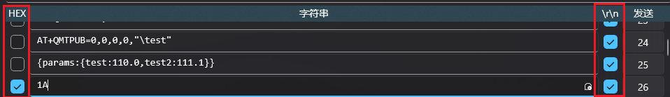

# NBIoT BC28模块使用

## 基本命令

驱动：**CH340**

波特率：**9600**

命令说明详见：[移远BC28 NB-IoT模块简介以及其常用的AT命令-CSDN博客](https://blog.csdn.net/NeWorld20/article/details/107290422)

## 上传需要使用的命令

1、查看版本（可用于检查是否有NB模块）

```
// 查看版本
ATI

Quectel
BC28-CNV
Revision:BC28CNVBAR02A03

OK
```

2、软复位NB模组

```
// 软复位
AT+NRB
```

3、查看卡状态

```
// 查看卡状态
AT+CIMI

460240208827370

OK
```

4、配置DNS

```
// 配置DNS
AT+QIDNSCFG="8.8.8.8","8.8.4.4"

OK
```

5、连接到EMQX服务器

```
// 连接到EMQX服务器
AT+QMTOPEN=0,"189.1.245.236",1883

OK

+QMTOPEN: 0,0 (等待此条出现后进行下一步配置客户端)

！！！！！！需要在这中间发送配置客户端信息的命令

+QMTSTAT: 0,1 (如果出现此条后说明服务器等待客户端信息超时，无法连接，需要重新发送本命令)
```

6、配置客户端信息

```
// 配置客户端
AT+QMTCONN=0,"clientid","XXXX","XXXXXXX" (此处请根据服务器端提供的账号信息配置命令)

OK

+QMTCONN: 0,0,0 (等待此条出现后进行下一步)
```

7、开始上传数据（三步走，开始+报文+结束）

```
// 告知开始上传数据，引号里面的是主题
AT+QMTPUB=0,0,0,0,"\test"

>
```

```
// 发送数据报文，格式自定义，这里仅做演示
{params:{test:110.0}}
```

```
// 告知结束发送,需要以16进制发送
1A

OK

+QMTPUB: 0,0,0
```


