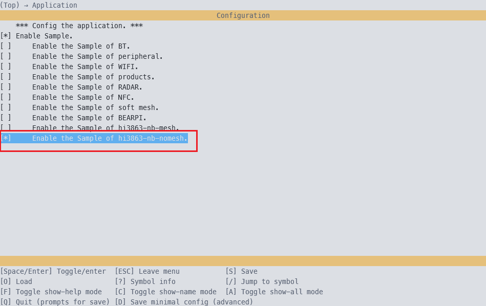
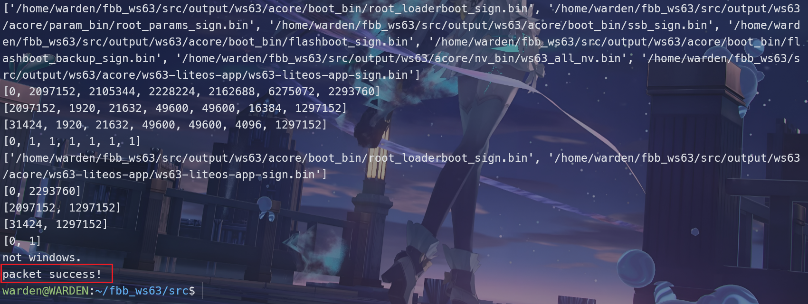
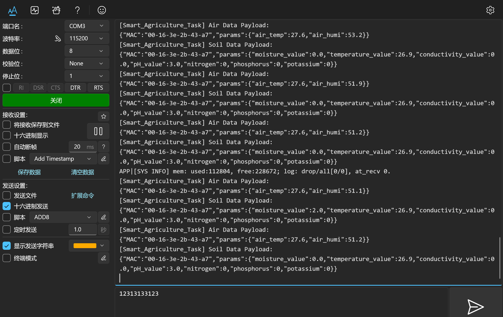
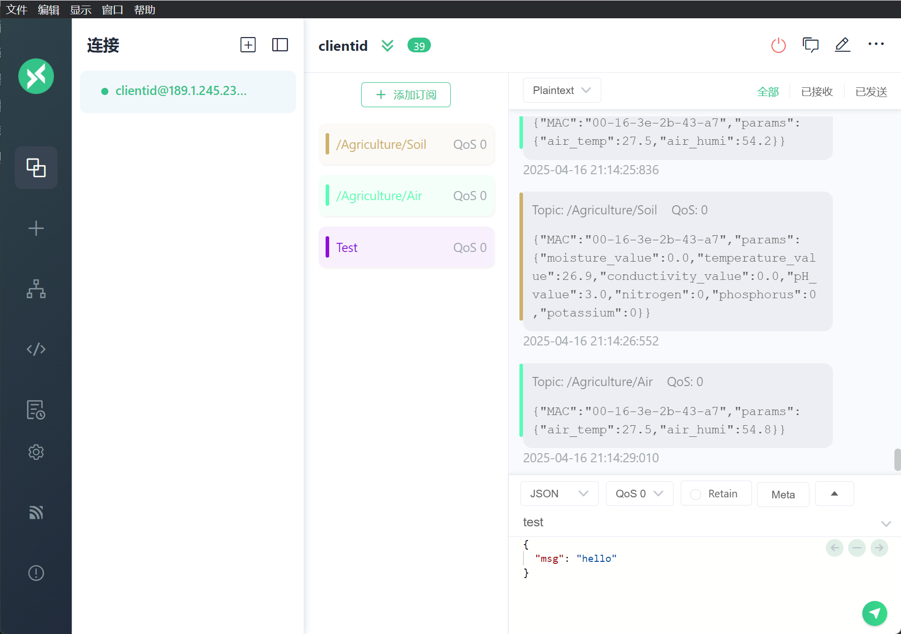

# hi3863-nb-curtain窗帘设备控制代码

该版本代码基于 Hi3863 搭配 NB 模组实现数据上报，节点通过 NB 模组直接接入公网，可以在公网远程控制设备。

## 1 搭建环境

请参照[WSL子系统开发环境搭建](../environment/WSL_Develop_Env.md)完成开发环境的搭建。

## 2 编译代码

请参照[Hi3863编译及烧录教程](../environment/WSL_Build_and_Burn.md)完成代码的拉取、编译和烧录。

## 3 拉取项目代码

```shell
git clone git@github.com:HarmonyAgriLab/south-node.git
```

## 4 部署代码

将 `environment/hi3863-nb-curtain`文件夹复制到 `fbb_ws63/src/application/samples/`路径下。


在 `fbb_ws63/src/application/samples/CMakeLists.txt`文件末尾添加如下代码：

```cmake
if(DEFINED CONFIG_ENABLE_HI3861_NB_CURTAIN)
    add_subdirectory_if_exist(hi3863-nb-curtain)
endif()
```

在 `fbb_ws63/src/application/samples/Kconfig`文件末尾添加如下代码：

```cmake
config ENABLE_HI3861_NB_CURTAIN
    bool
    prompt "Enable the Sample of hi3863-nb-curtain."
    default n
    depends on SAMPLE_ENABLE
    help
        This option means enable the sample of hi3863-nb-curtain.
```

在 `fbb_ws63/src`路径下执行如下命令，启动 Menuconfig 程序：

```shell
python3 build.py -c ws63-liteos-app menuconfig
```

选择需要编译的 `HI3861_NB_MESH`目标，勾选并保存退出：



在 `fbb_ws63/src`路径下执行如下命令，启动编译：

```shell
python3 build.py ws63-liteos-app
```



## 5 硬件接线

请按照如下引脚分配表和供电要求表连接线路：

### 引脚分配

| GPIO引脚 | 复用功能      | 用途            |
| -------- | ------------- | --------------- |
| GPIO_17  | UART0_TXD     | 烧录和debug串口 |
| GPIO_18  | UART0_RXD     | 烧录和debug串口 |
| GPIO_15  | GPIO          | 驱动电机        |
| GPIO_16  | GPIO          | 驱动电机        |
| GPIO_07  | UART2_RXD     | NB模组          |
| GPIO_08  | UART2_TXD     | NB模组          |


### 供电要求

| 设备           | 电压    | 是否需要接地 |
| -------------- | ------- | ------------ |
| 电机驱动       | 12和5 V | 需要         |
| NB模组         | 5 V     | 需要         |

## 6 烧录程序

请参照[Hi3863编译及烧录教程](../environment/WSL_Build_and_Burn.md)完成烧录。

## 7 启动程序

按下复位键启动程序，连接开发板串口，可见串口打印的上传报文数据。



在MQTT服务器可见节点上传的测量数据报文，这里通过[MQTTX：全功能 MQTT 客户端工具](https://mqttx.app/zh)订阅主题进行查看，对应的连接账号由服务器端提供。


