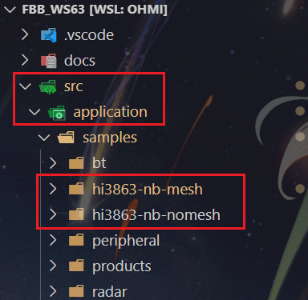
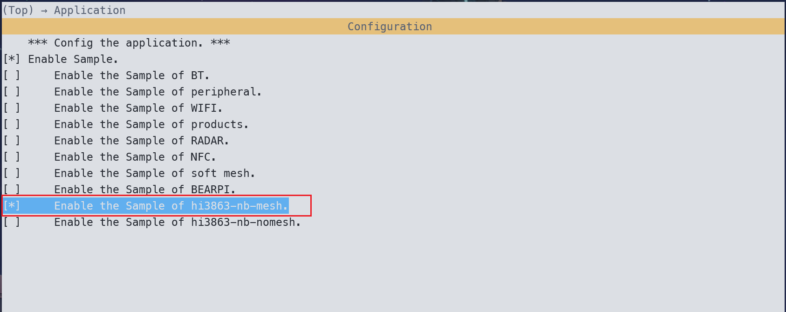
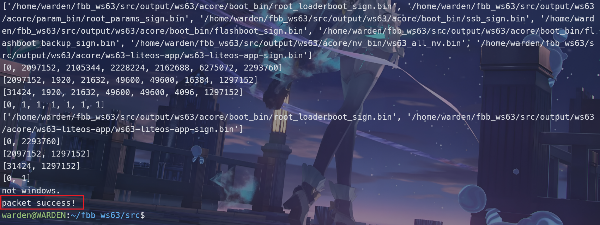
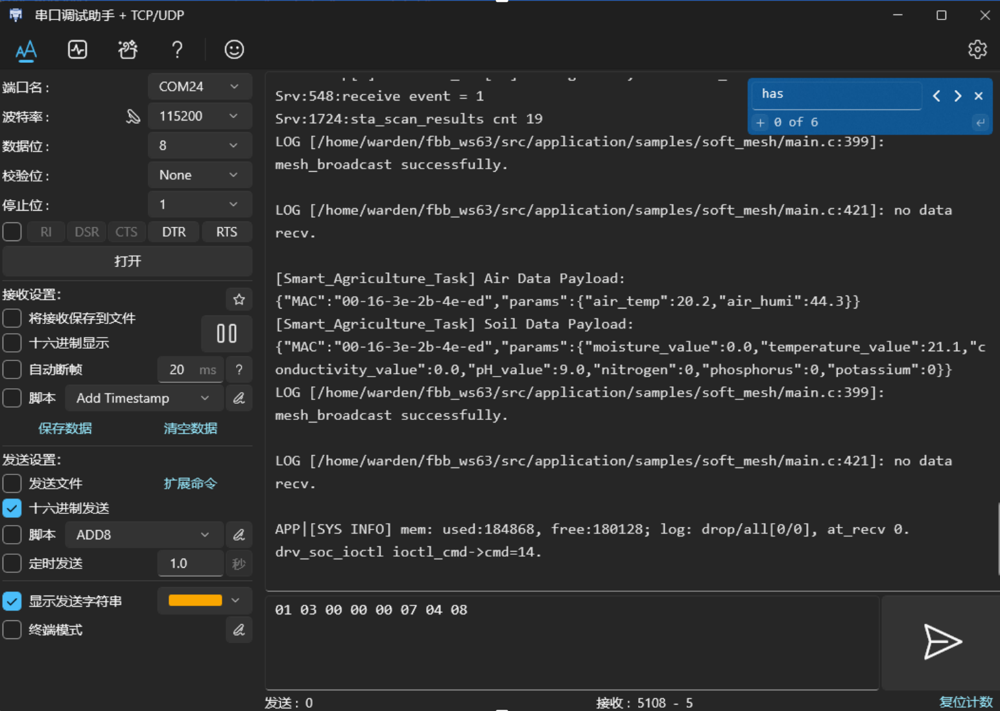
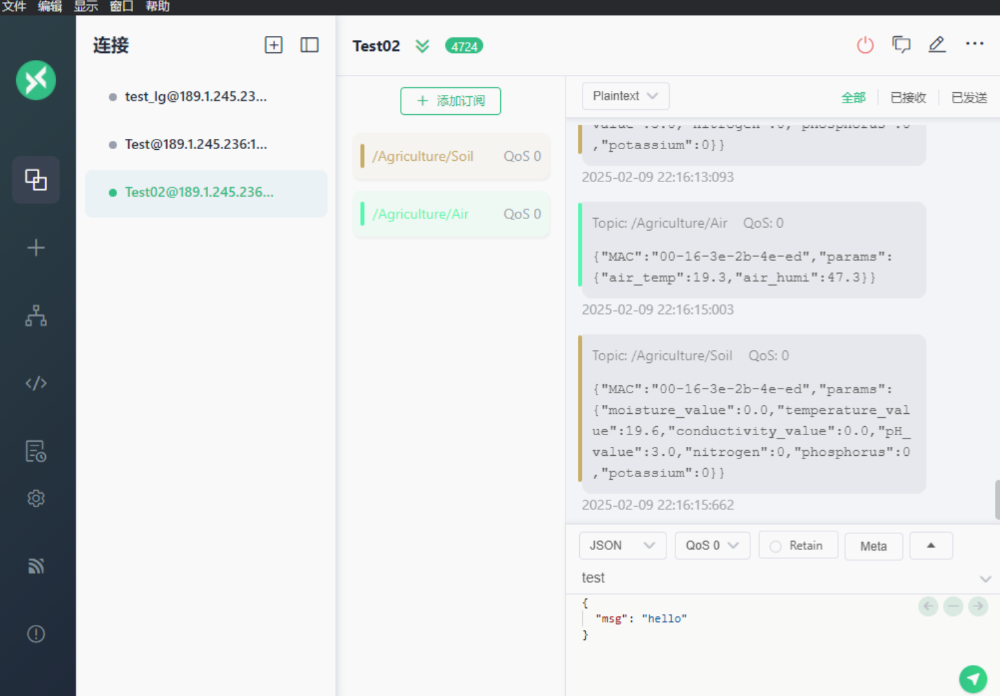

# hi3863-nb-mesh版本

该版本代码基于 Hi3863 搭配 NB 模组实现数据上报，节点通过 NB 模组直接接入公网，节点与节点之间通过 mesh 网络进行内部的组网通信，实现只需要部分节点有NB模组访问公网，整个mesh网络的节点都能访问公网。

## 1 搭建环境

请参照[WSL子系统开发环境搭建](../environment/WSL子系统编译及烧录.md")完成开发环境的搭建。

## 2 编译代码

请参照[WSL子系统开发环境搭建](../environment/WSL子系统开发环境搭建.md")完成代码的拉取、编译和烧录。

## 3 拉取项目代码

```shell
```

## 4 部署代码

将`environment/hi3863-nb-mesh`文件夹复制到`fbb_ws63/src/application/samples/`路径下。



在`fbb_ws63/src/application/samples/CMakeLists.txt`文件末尾添加如下代码：

```cmake
if(DEFINED CONFIG_ENABLE_HI3861_NB_MESH_SAMPLE)
    add_subdirectory_if_exist(hi3863-nb-mesh)
endif()
```

在`fbb_ws63/src/application/samples/Kconfig`文件末尾添加如下代码：

```cmake
config ENABLE_HI3861_NB_MESH_SAMPLE
    bool
    prompt "Enable the Sample of hi3863-nb-mesh."
    default n
    depends on SAMPLE_ENABLE
    help
        This option means enable the sample of hi3863-nb-mesh.
```

在`fbb_ws63/src`路径下执行如下命令，启动 Menuconfig 程序：

```shell
python3 build.py -c ws63-liteos-app menuconfig
```

选择需要编译的`HI3861_NB_MESH`目标，勾选并保存退出：



在`fbb_ws63/src`路径下执行如下命令，启动编译：

```shell
python3 build.py ws63-liteos-app
```



## 5 硬件接线


## 6 烧录程序

请参照[WSL子系统开发环境搭建](../environment/WSL子系统开发环境搭建.md")完成代码的烧录。

## 7 启动程序

按下复位键启动程序，连接开发板串口，可见串口打印的上传报文数据。



在MQTT服务器可见节点上传的测量数据报文，这里通过MQTTX客户端订阅主题进行查看。

